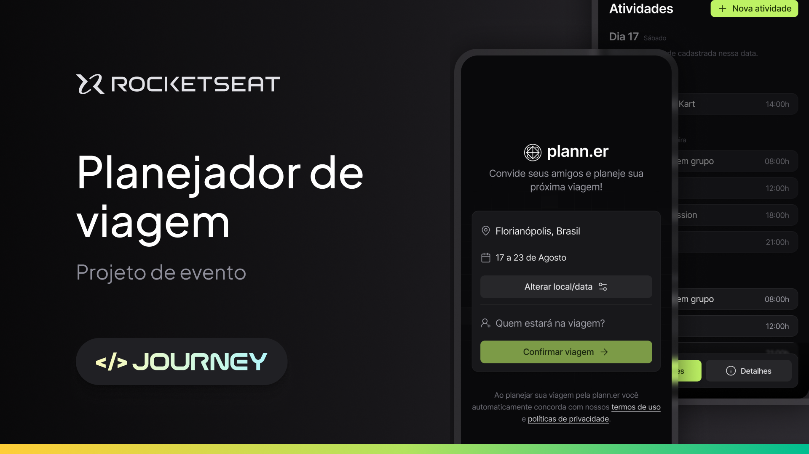

# RocketHelp

# Rocketseat NLW Journey React Native

Evento da [Rocketseat](https://www.youtube.com/c/RocketSeat). Aplicativo para planejamento de viagem, feito no evento NLW Journey - React Native.

## Requerimentos

- [Node](https://nodejs.org)
- [yarn](https://yarnpkg.com/getting-started/install) ou [npm](https://www.npmjs.com)
- [Expo](https://expo.dev/)

## Tech Stack

- [React](https://reactjs.org)
- [React Native](https://reactnative.dev)
- [TypeScript](https://www.typescriptlang.org)
- [Expo](https://expo.dev)
- [NativeWind](https://www.nativewind.dev/)
- [Lucide React Native](https://lucide.dev/guide/packages/lucide-react-native)
- [Zod](https://zod.dev/)
- [Axios](https://axios-http.com/ptbr/docs/intro)
- [Dayjs](https://github.com/iamkun/dayjs/blob/dev/docs/pt-br/README-pt-br.md)
- [Clsx](https://www.npmjs.com/package/clsx)
